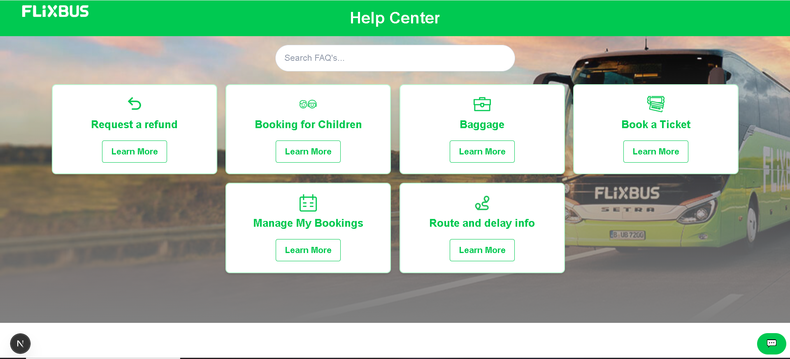
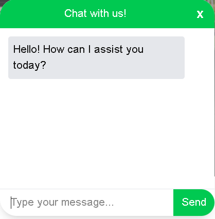

# Flix Mobility Tech - Frontend Engineer Take-Home Task

## Overview

This project is a **Responsive Web Application** designed for Flix Mobility Tech's Customer Service domain. The application simulates a modern, resourceful platform with an integrated AI-powered chatbot. The goal is to provide a user-friendly interface for customers to interact with the chatbot and access FAQs dynamically.

## Features Implemented

### 1. **Landing Page**
   - A welcoming page introducing users to the web chat application.
   - Includes **FAQ links** that users can click on learn more to route to **FAQ Detail** page to read more information 
   - A **floating button** to open the chatbot interface.
   - Minimal content with a brief introduction to the application.
   - Added a Middleware so that homepage localhost:300/ redirects to localhost:3000/help

### 2. **Responsive FAQ List**
   - A dynamic and responsive list of FAQs.
   - Users can click on FAQ tiles to view detailed information.
   - Optimized for various devices and screen sizes.

### 3. **Search Bar**
   - A search bar to filter FAQs based on user input.
   - Real-time filtering of FAQ tiles as the user types.
   - Clear button to reset the search input.

### 4. **AI-Powered Chatbot**
   - Integrated **Google Gemini API** for dynamic and intuitive responses.
   - Users can send messages and receive AI-generated responses.
   - The chatbot interface is responsive and user-friendly.

### 5. **Responsiveness**
   - The entire application is optimized for various devices and screen sizes.
   - Ensures a seamless experience across desktops, tablets, and mobile devices.

## Tech Stack

- **Frontend Framework**: Next.js v15 (App Router)
- **UI Library**: React v19
- **Styling**: Tailwind CSS
- **AI Integration**: Google Gemini API
- **Testing**: Jest and React Testing Library

## Why Next.js v15 and React v19?

- **Next.js v15**:
  - **App Router**: Provides a more intuitive and optimized routing system.
  - **Performance**: Built-in optimizations for faster page loads and better SEO.
  - **Server-Side Rendering (SSR)**: Enhances performance and user experience.

- **React v19**:
  - **Concurrent Rendering**: Improves performance by allowing React to work on multiple tasks simultaneously.
  - **Enhanced Hooks**: Better state management and side-effect handling.
  - **Optimized Re-renders**: Reduces unnecessary re-renders, improving performance.

## How to Run the Project

### Prerequisites

- Node.js (v20)
- npm (v9 or higher)
- Google Gemini API Key (for chatbot functionality)

### Steps

1. **Clone the Repository**:
   ```bash
   git clone https://github.com/VivBhatnagar/flix-smart-health-center
   cd flix-smart-health-center


2. **Install Dependencies**:
   ```bash
   npm install 

3. **Set Up Environment Variables**:
    There is a .env file in the root directory.
    Add your Google Gemini API key there:
   ```bash
    NEXT_PUBLIC_GEMINI_API_KEY={YOUR_KEY_HERE}

4. **Run the Development Server**:    
   ```bash
    npm run dev

5. **Open the Application**:

    Visit http://localhost:3000 in your browser.

## Testing

-   **Unit Tests**: Written using Jest and React Testing Library.
-   **Test Coverage**: Focused on core functionalities like message sending, FAQ filtering, and responsiveness
    ```bash
     npm test

### Best Practices Followed

-   **Modular Code**:
    Components are broken down into reusable and modular pieces.
    Example: SearchBar, FAQList, Chatbot, etc

-   **Responsive Design**:

    Tailwind CSS is used to ensure the application is fully responsive.
    Media queries and flexbox/grid layouts are utilized for optimal responsiveness.

-   **Accessibility**:

    Semantic HTML tags are used for better accessibility.
    ARIA labels and roles are added where necessary. 

-   **Error Handling**:

    Proper error handling for API calls and user inputs.
    Fallback UI for failed API requests.


## Documentation

-   **Code Comments**: Inline comments are added to explain complex logic and key decisions.

-   **README**: Detailed documentation of the project setup, features, and best practices.

-   **Trade-offs**:

    Due to time constraints, some advanced features like contact us modal and persistent chat history were not implemented.
    If given more time, I would focus on adding these features and improving test coverage.

## Future Improvements
-   **User Authentication**: Add user authentication to personalize the chatbot experience.

-   **Persistent Chat History**: Store chat history in local storage or a database for continuity.

-   **Chatbot Reset Button**: To reset the chat history and start a new conversation

-   **Advanced Search**: Implement a more advanced search algorithm for FAQs.

-   **Analytics**: Track user interactions to improve the chatbot's responses over time.    


## Conclusion

-   This project demonstrates my ability to design and implement a responsive, user-friendly web application with modern technologies like Next.js, React, and Tailwind CSS. The integration of Google Gemini API for the chatbot adds a dynamic and interactive element to the application. I have followed best practices in coding, testing, and documentation to ensure a high-quality deliverable.


## Screenshots

  **Landing Page**


  **Chatbot UI**

